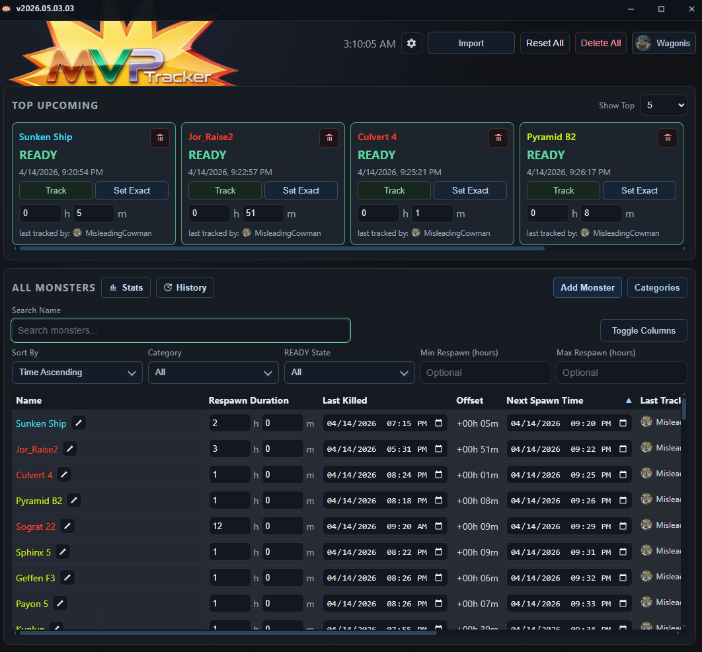
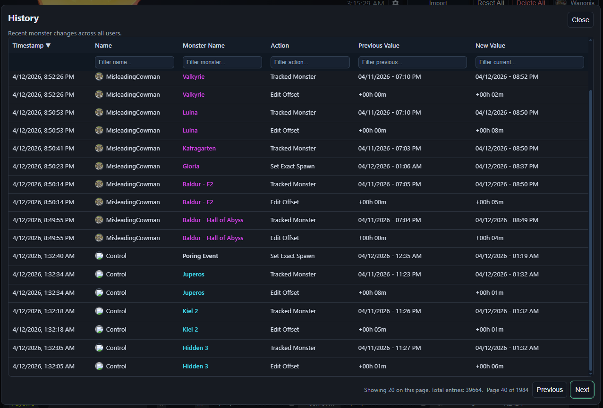
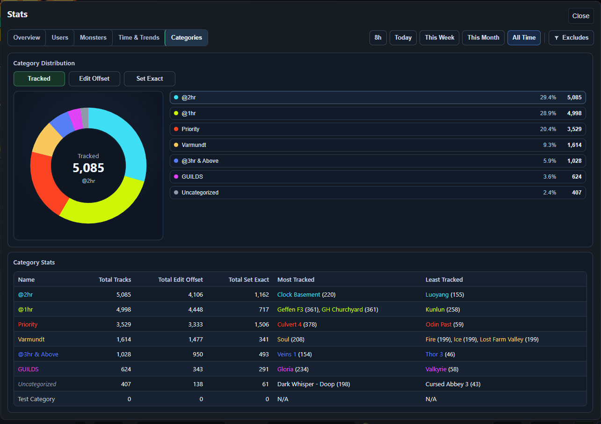

# MVP-Tracker

MVP-Tracker is an Electron desktop app for collaborative monster spawn-timer tracking.

It was originally built for MVP farming in Ragnarok Online, but the timer system is game-agnostic. It supports fixed respawn intervals, manual spawn corrections, realtime collaboration, authenticated users, spawn alerts, and local analytics powered by DuckDB.

## Screenshots
### Main Tracker View

### History and Analytics

## Features

- Track monsters with fixed respawn timers.
- Manually correct timers for variable or inconsistent spawn behavior.
- Realtime collaborative updates across multiple users.
- Firebase Authentication for user login and collaboration.
- CSV import for monster data.
- Clipboard import using the `{Monster}\t@{time}` format.
  - Example: `Test Monster\t@3hr`
- Spawn alerts with sound notifications.
- Custom alert sound support.
- Fixed global hotkeys for fast timer updates.
- Category management, search, and filtering.
- History tracking for spawn/timer activity.
- Local analytics and statistics powered by DuckDB.
- Desktop packaging workflow for Windows and macOS release builds.

## Platform Support

MVP-Tracker currently supports:

- Windows
- macOS

Because the app is built with Electron, it can be adapted for other platforms with additional configuration.

## Prerequisites

- [Node.js 20 or newer](https://nodejs.org/en/download)
- [npm](https://docs.npmjs.com/downloading-and-installing-node-js-and-npm)
- [Firebase project](https://console.firebase.google.com/)

## Quick Start

### 1. Install dependencies

    npm install

### 2. Configure environment variables

Copy `.env.example` to `.env`:

    copy .env.example .env

On macOS/Linux:

    cp .env.example .env

Then fill in the required Firebase configuration values.

### Required Environment Variables

| Variable | Description |
| --- | --- |
| `VITE_FIREBASE_API_KEY` | Firebase Web API key for the app config. This is an identifier, not a strong secret. |
| `VITE_FIREBASE_AUTH_DOMAIN` | Firebase Auth domain, usually `your-project.firebaseapp.com`. |
| `VITE_FIREBASE_PROJECT_ID` | Firebase project ID used for Firestore, Auth, and related services. |
| `VITE_FIREBASE_STORAGE_BUCKET` | Default Cloud Storage bucket for the Firebase project. |
| `VITE_FIREBASE_MESSAGING_SENDER_ID` | Firebase Cloud Messaging sender ID. |
| `VITE_FIREBASE_APP_ID` | Firebase app ID for this web app instance. |

### 3. Start development

    npm run dev

## Scripts

| Command | Description |
| --- | --- |
| `npm install` | Install project dependencies. |
| `npm run dev` | Start the renderer, Electron main process watcher, and Electron app. |
| `npm run build` | Build the renderer and Electron main outputs. |
| `npm run dist:win` | Build and package Windows release artifacts using NSIS. |
| `npm run dist:mac` | Build and package macOS release artifacts. |

## Firebase Setup

MVP-Tracker requires Firebase for authentication and realtime collaboration.

### Firebase Authentication

Enable at least one sign-in provider in Firebase Authentication.

Depending on your auth flow, you may also need to configure:

- Authorized domains
- Redirect domains
- OAuth provider settings

### Cloud Firestore

Create and configure Cloud Firestore for shared monster, category, user, and history data.

Firestore is used for collaborative timer state and shared app data.

## Security Notes

Do not deploy this app with permissive Firestore rules in production.

Recommended minimum protections:

- Require authenticated users for reads and writes.
- Restrict user profile writes to the authenticated user's own document.
- Validate required fields and field types in Firestore rules.
- Avoid storing sensitive secrets in `VITE_` environment variables.

## Data and Storage

MVP-Tracker uses a combination of local and remote storage.

### Local DuckDB Cache

Local history and analytics data are stored in a DuckDB database file under Electron `userData`:

    mvp-tracker-local-cache.duckdb

This file may grow over time as history and analytics data increase.

### Local UI Preferences

UI preferences are stored in browser `localStorage` inside Electron's Chromium profile.

Current preference keys include:

| Key | Purpose |
| --- | --- |
| `mvp-tracker.alert-settings.v1` | Alert settings, including custom sound file path. |
| `mvp-tracker.global-hotkeys-enabled.v1` | Whether global hotkeys are enabled. |
| `mvp-tracker.auto-return-to-previous-app-enabled.v1` | Whether the app returns focus to the previous app after hotkey actions. |
| `mvp-tracker.sound-enabled.v1` | Whether sound alerts are enabled. |
| `mvp-tracker.top-count.v1` | Number of upcoming monsters shown in the top cards. |
| `mvp-tracker.table-sort.v1` | Saved table sorting preference. |
| `mvpTracker.monsterTableColumnVisibility.v1` | Saved monster table column visibility settings. |

## Import Formats

### CSV Import

Monster data can be imported from CSV files.

### Clipboard Import

Clipboard import supports the following tab-separated format:

    {Monster Name}<tab>@{time}

Example:

    Test Monster    @3hr

Monster names may include spaces.

## Hotkeys

Current global hotkey bindings are fixed and are not user-remappable yet.

| Hotkey | Action |
| --- | --- |
| `Ctrl/Cmd + 1..9` | Focus the Offset Minutes input for rows 1 through 9. |
| `Ctrl/Cmd + Alt + 1..9` | Open Set Exact for rows 1 through 9. |

## Current Scope

MVP-Tracker currently supports:

- Hundreds of monster timer rows in realtime.
- Multi-user collaboration through Firebase.
- Shared monster, category, and timer state.
- Spawn/timer history tracking.
- Local analytics using DuckDB.
- Portable desktop distribution.
- Runtime cache and analytics growth based on local DB size.

## Roadmap

Planned or possible future improvements:

- Offline mode for local-only users.
- Customizable global hotkeys.
- Spoken monster-name alerts on spawn.
- Minimal or customizable views.
- Data export tools.
- Additional analytics dashboards.
- Improved portable data management.
- Better docs (i.e `wiki`)

## Contributing

Pull requests are welcome.

All PRs should be reviewed before merging.

## License

MIT License.
